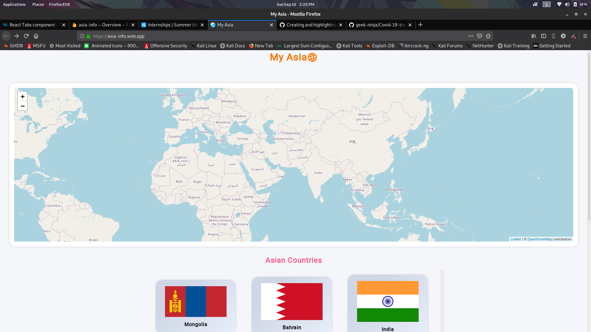
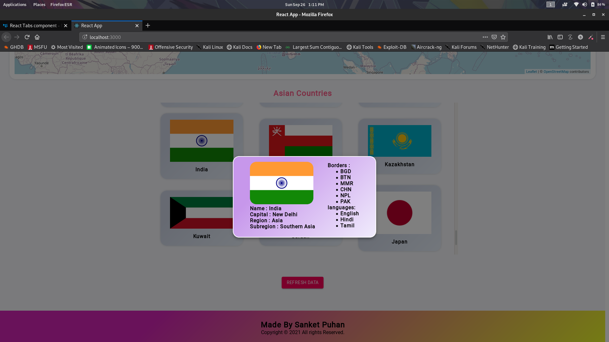
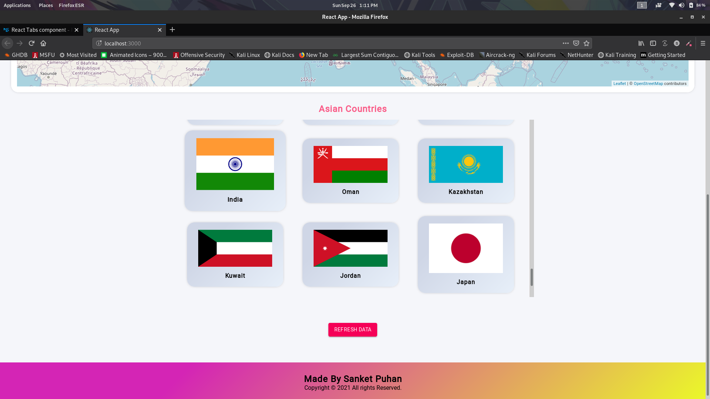

# Asia-Info

[](https://forthebadge.com)
[](https://forthebadge.com)
[](https://forthebadge.com)
[](https://forthebadge.com)

<h2>The Hosted Website Link below: <h2>
https://asia-info.web.app/

<br><br>
  <h2>About </h2>
<p>This is a reactjs based project along with api and hosted on firebase server</p>
<p>This is simple website which provides different informations of asian countries</p>
<p>The REST API used :</p>
https://restcountries.com/v3/region/asia

   <h3>Project Screenshot</h3>
  
  
  
  
  
  
  
<h2>How To Run</h2>
<h3>Command</h3>
<h3>npx create-react-app your_project_name(asiainfo)</h3>
<p>The above command with setup your react app</p>
<h3>npm start</h3>
<p>The above command will run your app on localhost</p>
<h2>Now install few modules for the app</h2>
  <p>npm i firebase</p>
  <p>npm install @material-ui/core</p>
  <p>npm install @material-ui/icons<p>
  <p>npm i leaflet</p>
  <p>npm i react-leaflet</p>
  <p>npm i axios</p>

  <h2>NOTE**</h2>
  <p>Change the version of react-leaflet to ^2.7.0 in package.json file</p>
  
  ```json
  
  {
  "name": "asiainfo",
  "dependencies": {
    "@material-ui/core": "^4.12.3",
    "@material-ui/icons": "^4.11.2",
    "axios": "^0.21.4",
    "firebase": "^9.1.0",
    "leaflet": "^1.7.1",
    "react": "^17.0.2",
    "react-leaflet": "^2.7.0",
  },
  ```
  
  
  <p>After installations of the packages replace the src folder with your react app created </p>
  <h3>npm run build</h3>
  <p>The above command will build the final project</p>
 
<h2>Hosting in Firebase</h2>
  <p>Creat your firebase account then in command line use the following commands</p>
  <p>firebase login<p>
  <p>Login to your firebase account using command line</p>
  <p>firebase init</p>
  <p>Select existing project and choose the project name that you have created in firebase website</p>
  <p>Then type 'y' for yes and then then type 'build' to create the host</p>
  
